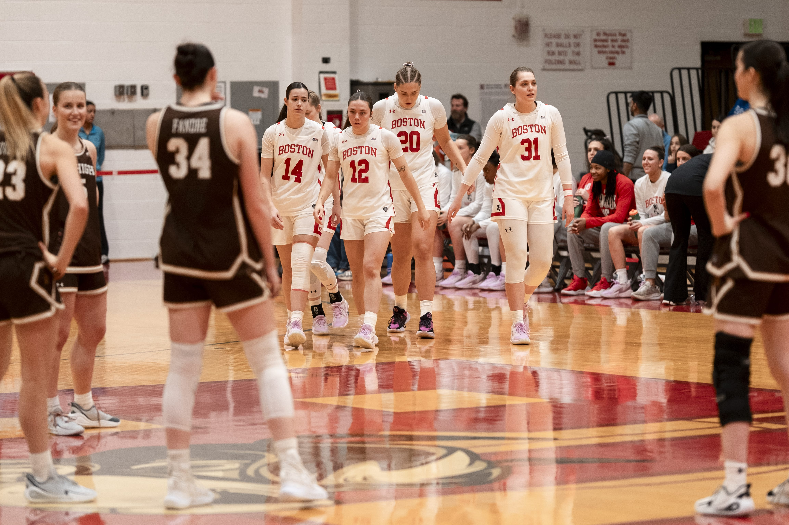
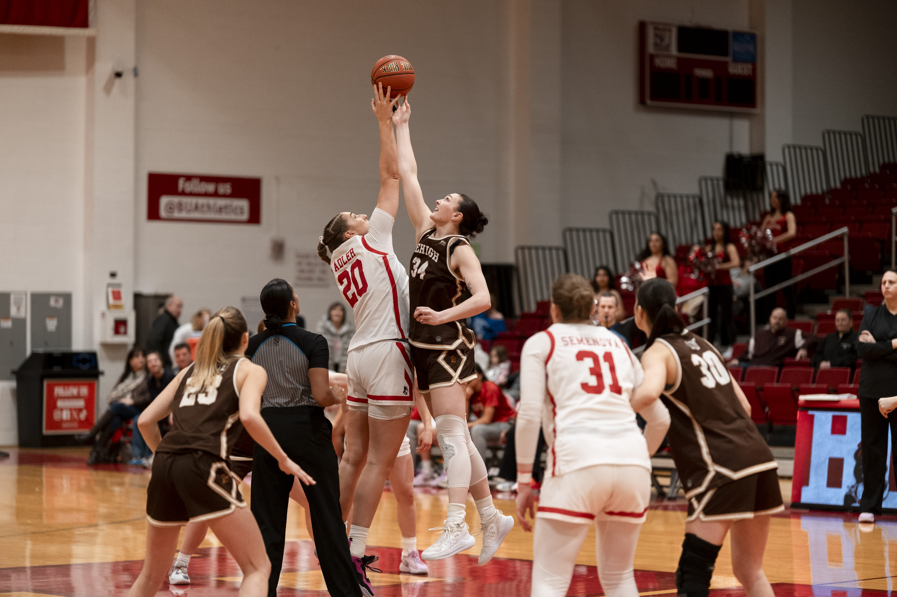
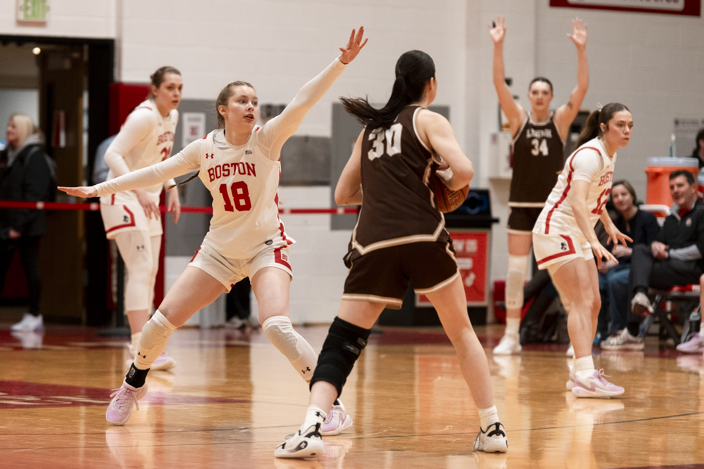
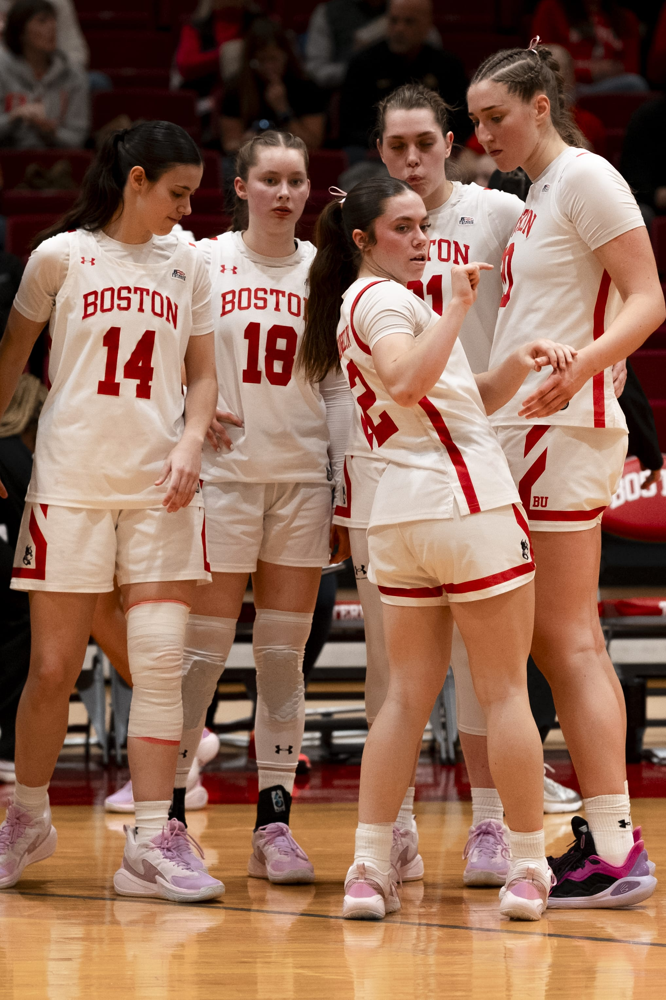

+++
title = "Reflections on WBB"
date = "2026-03-06T16:15:30-05:00"
#dateFormat = "2006-01-02" # This value can be configured for per-post date formatting
author = "y_b"
authorTwitter = "" #do not include @
cover = "cover.jpg"
tags = ["2026", "sports-photography", "BU"]
description = "Reflection on my ability to cover sports"
showFullContent = false
readingTime = false
hideComments = false
+++

# Changes

Remember last time when I said I wasn't ready to pull the trigger on yet another thousand dollar toy to fuel my money burning hobby? Well...

I saw a Nikon Z6 with a 24-70 F4 for sale on Facebook Marketplace a while ago. In one of the games I was talking to the photographer from the opposing team who had two A9's strapped to his sides, and he recommended Canons and Nikon mirrorlesses for their tried and trued ergonomics over the software advantages of Sony's metal box full of buttons. 

On a Monday that school was canceled because Boston was yet again snowing record breaking amount I decided to meet the seller of the Z6. I took the blue line to Orient Heights and came back with said Nikon, kit lens, two XQD cards, battery, and a peak design strap.

I first used the two bodies together on a hockey game. The first thing that struck me was that there was very little time to switch bodies. I thought that I could cover far away action with my XT-4 and, as the denouement came closer to my end, quickly switch to the 24-70mm. I don't know what sort of sacrifices have to be made in order to cover both ends of the field, but I guess only trial and error will tell.

# Another Round

Before I bought the Z6, I also had another chance to cover WBB. This time, I made a mental note of the places I would be, and the types of shots I'd be able to produce in each segment of the game.

I've gotten this shot before at a couple different games, but this is the first time that I looked for it. The downside of this shot is the composition makes it seems like their team is so much bigger than ours, and that our team is already looking prophetically defeated. Perhaps shooting from the back can prevent both of these.

This is a good shot, except I wish I had a much more aggressive crop so that I can catch just the two in the middle. Now that I know our N.20 is right handed I might try to shoot this from the other side to catch more of her face.

## Range

Just as even the best 3-point shooters have limits on their range, so I've been learning to work with the range of my Viltrox 72mm f1.2. Essentially a 108mm equivalent, I can catch full body shots of much of our defence on the 3-point line, and offense near the opponents' 3-point line as well. Thereabouts end my range, and things closer dramatically decrease my hit rate.

When the action does get closer, I am presented with the dilemma of where to crop. I feel that actions shots do not make sense if the hoop or backboard is not in view. I also struggle to follow and track players at such close distance. Perhaps this can be helped by the zoom lens on the Z6.

## Non-Actions

My primary goal during the game is to capture emotions. While action shots do so very well by demonstrating excitement and conflict, other moments can do so just as well.

I've been watching out for more of these as well. However, it is hard to catch communication in game, whether because one of them have their backs to me, or it is so quick that I miss the moment.

___

I have also just completed a fashion street shoot for BU Buzz, maybe I'll have some more insight on that.

